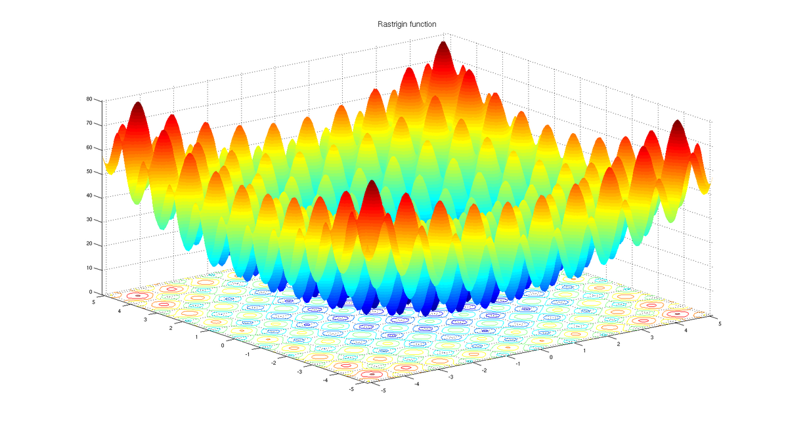

# Simple Genetic Algorithm (SGA)
単純GAをpythonにより実装した．

## モデル
単純GAだが，遺伝子構成をグレイコードに変えることができる．
`/assets/src/main.py`でハイパーパラメータを変更するだけでいろいろ試せる．

```python
GRAYCODE = True
```

## 実行
```bash
cd ./src
python main.py
```

## 例題：N次元Rastrigin関数
`/assets/src/utils.py`に$N$次元のRastrigin関数がある．

$N$はいじれるが、`/assets/src/main.py`でハイパーパラメータの設定で遺伝子数を変更する必要がある．

$$
\begin{align}
	f\left( \boldsymbol{x} \right)
	&= An + \sum^{n}_{i = 1}
	\left( x^{2}_{i} - A \cos\left(2\pi x_{i}\right) \right)
\end{align}
$$

このとき，$A = 10, x_{i} \in \left[ -5.12, 5.12 \right]$である．



## 今後の方針
空間重点曲線により遺伝子数1で高次元空間を最適化できるようにしたい．
